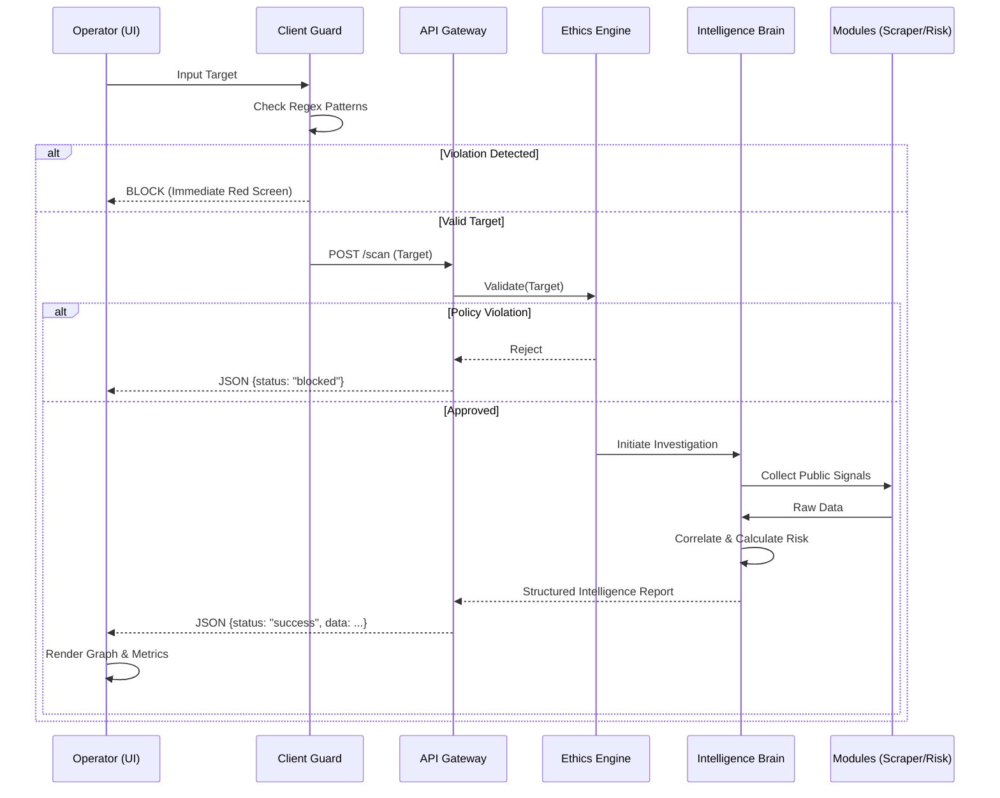

# System Architecture: Nexis Intelligence Protocol

## 1. Executive Summary
Nexis OS is a specialized, open-source intelligence analysis dashboard designed for authorized ethical surveillance and risk assessment. It utilizes a modular, agentic architecture to aggregate, correlate, and visualize public data signals in real-time. The system prioritizes ethical guardrails, ensuring compliance effectively at both the client and server levels.

## 2. Architectural Patterns
The system follows a **Client-Server** architecture with a **Service-Oriented** backend design.
- **Frontend**: Single-Page Application (SPA) behavior using Vanilla JS for maximum performance and strict state management.
- **Backend**: Flask-based REST API serving as the orchestration layer for intelligence modules.
- **Data Layer**: Ephemeral, in-memory processing for privacy (no persistent database for target data).

## 3. Core Components

### 3.1 Frontend Presentation Layer (`dashboard.html`)
*   **UI State Machine**: Strictly manages application states (`READY`, `SCANNING`, `BLOCKED`, `RESULTS`) to prevent race conditions and ensure UI consistency.
*   **Visualization Engine**: Integrates `vis.js` for dynamic node-edge graphing of intelligence entities.
*   **Safety Layer**: Client-side regex pre-checks to instantly reject restricted targets (e.g., Private IPs, SSNs) before network requests.

### 3.2 API Layer (`routes.py`)
*   **Endpoints**:
    *   `GET /`: Serves the console interface.
    *   `POST /scan`: Accepts target identifiers, triggers the Brain, and returns JSON intelligence reports.
*   **Role**: Handles request validation, rate limiting (implied), and response serialization.

### 3.3 Intelligence Core (`brain.py`)
The "Brain" is the central orchestrator that coordinates specialized sub-modules:
*   **EthicsGuardian**: The gatekeeper module. Validates every target against the Forbidden Patterns list. If validation fails, the entire pipeline halts immediately.
*   **SocialScraper**: A safe, simulated data collection module that mimics public data retrieval for demonstration purposes.
*   **Correlator**: Analyzes disparate logic signals to find links between entities (e.g., Username A maps to Email B).
*   **RiskEngine**: Quantifies risk based on a weighted scoring algorithm (`Risk = Impact * Likelihood`).
*   **ReverseOSINT**: Infers potential surveillance exposure based on data availability.

## 4. Data Flow Architecture

## 5. Security & Ethics Architecture
Nexis OS implements a "Defense-in-Depth" approach to ethics:
1.  **Layer 1 (Client)**: Instant feedback loop. Prevents accidental submission of sensitive data.
2.  **Layer 2 (Server)**: Authoritative check. Cannot be bypassed by manipulating client-side code.
3.  **Layer 3 (Module)**: safe-by-design data collection (using public APIs or simulation).

## 6. Technology Stack
*   **Runtime**: Python 3.9+
*   **Framework**: Flask (Micro-framework)
*   **Frontend**: HTML5, CSS3 (Grid/Flexbox), ES6 JavaScript
*   **Visualization**: Vis.js Network
*   **Environment**: Cross-platform (Windows/Linux/MacOS)
