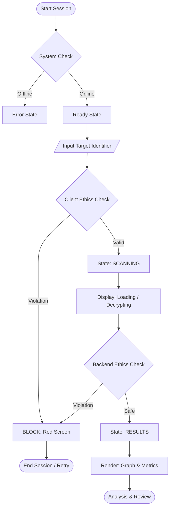

# Operational Workflows & Protocols

## 1. Overview
This document outlines the standard operating procedures (SOPs) and internal system workflows for the Nexis OS Intelligence Console. It is intended for operators and developers to understand the "Life of a Scan."

## 2. Operator Workflow (User Journey)

The following diagram illustrates the standard operator interaction flow:

### Phase 1: Initialization
1.  **Access**: Operator navigates to the secure terminal URL.
2.  **System Check**: Dashboard performs auto-diagnostics (Connectivity: Online, Ethics: Active).
3.  **State**: System enters `READY` mode, unlocking the input terminal.

### Phase 2: Target Acquisition
1.  **Input**: Operator enters a Target Identifier (Username, Email, or Domain).
2.  **Constraint**: Private identifiers (IPs, Phone Numbers, SSNs) are strictly prohibited.
3.  **Submission**: Operator triggers the "INITIALIZE SCAN" protocol.

### Phase 3: Monitoring & Feedback
1.  **Visual Feedback**: Interface locks input and displays "SCANNING global networks".
2.  **Progress**: (Optional) UI displays real-time milestones (Network Init -> Decryption -> Correlation).
3.  **Ethics Intercept**: If a threat is detected during scanning, a "TARGET ACQUISITION BLOCKED" screen overrides all displays.

### Phase 4: Intelligence Review
1.  **Dashboard Load**: Upon success, the `RESULTS` view renders.
2.  **Analysis**:
    *   **Graph**: Interact with nodes to visualize connections.
    *   **Risk Meter**: Review the quantitative risk score (0-100).
    *   **Inferences**: Read Reverse-OSINT warnings.
    *   **Evidence**: verifying individual data points and their source stability.

## 3. Internal Intelligence Lifecycle (System Logic)

The following workflow describes how the `IntelligenceBrain` processes a request:

1.  **Ingestion**: Target string is normalized (trimmed, lowercased).
2.  **Validation (The Gatekeeper)**:
    *   `EthicsGuardian` checks target against `FORBIDDEN_PATTERNS`.
    *   **PASS**: Proceed.
    *   **FAIL**: Return `{status: "blocked", error: "Reason"}` immediately.
3.  **Collection**:
    *   `SocialScraper` generates/fetches signals (simulated for demo safety).
    *   Signals are tagged with `source`, `type`, and `confidence`.
4.  **Processing**:
    *   `Correlator` maps Primary ID -> Secondary Signals.
    *   `RiskEngine` aggregates signal weights to calculate `risk_score`.
    *   `ReverseOSINT` analyzes the specific combination of signals to determine "Indexability".
5.  **Serialization**: Final report object is constructed and sent to the frontend.

## 4. Error Handling & Fail-Safe Protocols

| Scenario | System Response | UI Behavior |
| :--- | :--- | :--- |
| **Network Failure** | Exception caught in `routes.py`, returns 500. | Console logs error, "SYSTEM FAILURE" message displayed. |
| **Ethics Violation** | `EthicsGuardian` raises flag. | **RED SCREEN**. All data hidden. Incident logged. |
| **Empty Result** | Analyzer returns 0 signals. | "No Intelligence Found" empty state (or partial graph). |
| **Frontend Crash** | JS Error in `renderReport`. | `catch` block logs error to console; Navigation remains accessible. |

## 5. Maintenance Procedures
*   **Log Rotation**: Operational logs in the dashboard are ephemeral (session-based).
*   **Pattern Updates**: `FORBIDDEN_PATTERNS` in `ethics.py` and `dashboard.html` must be kept in sync manually to ensure dual-layer protection.
